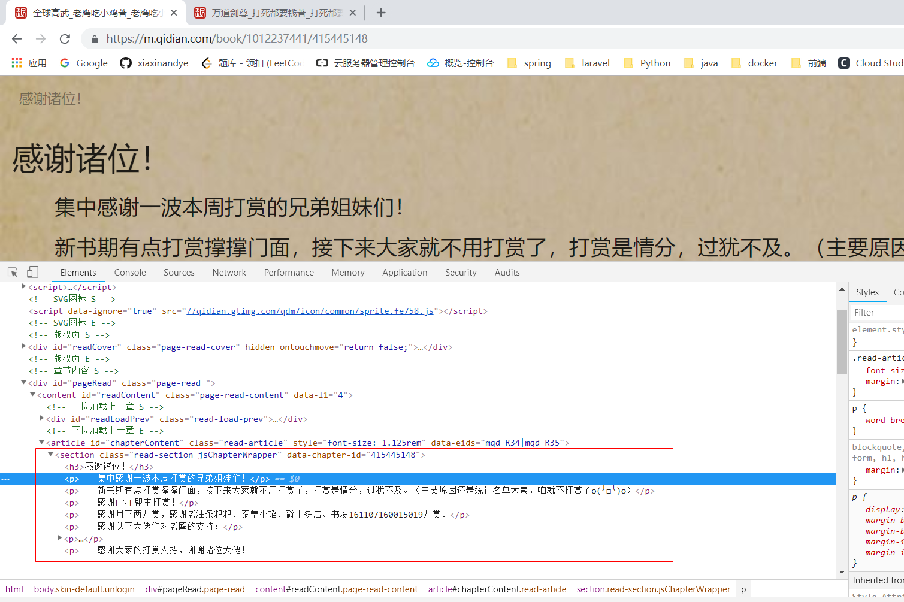

# 一、开发环境

- 框架：Scrapy

- IDE：Visual Studio Code


# 二、开发

## 1、编写代码--获取书籍

1. 新建一个 Scrapy 项目

   ```
   scrapy startproject novels
   ```

2. 新建一个 Spider 用于爬取起点

   ```
   cd novels
   scrapy genspider qidian qidian.com
   ```

3. 构造请求

   在 Spider中定义 start_requests() 方法，用来生成当月月票榜的分类请求。

   

   ```python
   
       def start_requests(self):
           # 分别对应玄幻、奇幻、武侠、仙侠、都市、现实、军事、历史、游戏、体育、科幻、悬疑灵异、二次元 共13个分类id
           category = ['21', '1', '2', '22', '4', '15', '6', '5', '7', '8', '9', '10', '12']
           data = {}
           base_url = 'https://www.qidian.com/rank/yuepiao?'
           for chn in category:
               data['chn'] = chn
               for page in range(1, self.settings.get('MAX_PAGE') + 1):
                   data['page'] = page
                   params = urlencode(data)
                   url = base_url + params
                   yield Request(url=url, callback=self.parse)
   ```

4. 提取信息

   定义一个 Item 用来存放书籍的信息。

   ```python
   # -*- coding: utf-8 -*-
   
   # Define here the models for your scraped items
   #
   # See documentation in:
   # https://doc.scrapy.org/en/latest/topics/items.html
   
   import scrapy
   
   
   class NovelItem(scrapy.Item):
       id = scrapy.Field()
       name = scrapy.Field()
       author = scrapy.Field()
       word_counts = scrapy.Field()
       chapter_counts = scrapy.Field()
       descrption = scrapy.Field()
       cover_image = scrapy.Field()
       cover_thumb = scrapy.Field()
       tickets_month = scrapy.Field()
       tickets_recommend = scrapy.Field()
       published_date = scrapy.Field()
       category_name = scrapy.Field()
       table = 'novel'
       fk_table = 'nov_cat'
       fk_column = 'category_id, novel_id'
      
   ```

   改写 Spider 用于解析数据：

   ```python
      def parse(self, response):
           books = response.css('.book-img-text li')
   
           for book in books:
               item = NovelItem()
               item['id'] = book.css('.book-img-box a::attr("data-bid")').extract_first()
               # 日志打印
               self.logger.debug(item['id'])
               # 使用 response.urljoin 方法获取绝对图片src
               item['cover_thumb'] = response.urljoin(book.css('.book-img-box img::attr("src")').extract_first())
               self.logger.debug(item['cover_thumb'])
               item['name'] = book.css('.book-mid-info a::text').extract_first()
               self.logger.debug(item['name'])
               item['author'] = book.css('.author .name::text').extract_first()
               self.logger.debug(item['author'])
               item['category_name'] = book.css('.author a:nth-child(4)::text').extract_first()
               self.logger.debug(item['category_name'])
               yield item
   ```

5. 存储书籍的部分信息

   编写一个 MysqlPipeline：

   ```python
   import pymysql
   
   class MysqlPipeline():
       def __init__(self, host, database, user, password, port, category):
           self.host = host
           self.database = database
           self.user = user
           self.password = password
           self.port = port
           self.category = category
   
       @classmethod
       def from_crawler(cls, crawler):
           return cls(
               host = crawler.settings.get('MYSQL_HOST'),
               database = crawler.settings.get('MYSQL_DATABASE'),
               user = crawler.settings.get('MYSQL_USER'),
               password = crawler.settings.get('MYSQL_PASSWORD'),
               port = crawler.settings.get('MYSQL_PORT'),
               category = crawler.settings.get('CATEGORY')
           )
       
       def open_spider(self, spider):
           self.db = pymysql.connect(self.host, self.user, self.password, self.database, charset='utf8', port=self.port)
           self.cursor = self.db.cursor()
   
       def close_spider(self, spider):
           self.db.close()
   
       def process_item(self, item, spider):
           keys = 'author, cover_thumb, id, name'
           values = [item['author'], item['cover_thumb'], item['id'], item['name']]
           values_sql = ', '.join(['%s'] * len(values))
           sql = 'insert into %s (%s) values(%s)' % (item.table, keys, values_sql)
           # print(sql)
           self.cursor.execute(sql, tuple(values))
           if item['category_name'] == '现实':
                 # 将现实分类id转为都市分类id
                 category_id = '4'
           else:
               category_id = self.category[item['category_name']]
           # 插入数据到中间表中
           values = [category_id, item['id']]
           values_sql = ', '.join(['%s'] * len(values))
           sql = 'insert into %s (%s) values(%s)' % (item.fk_table, item.fk_column, values_sql)
           # print(sql)
           self.cursor.execute(sql, tuple(values))
           self.db.commit()
           return item
   ```

## 2、获取书籍的详细信息

书籍的部分信息已经存储到数据库中了，我们需要通过这些已知的书籍部分信息，去获取书籍的详细信息，如简介、月票等。此时考虑新建一个 Spider 用于获取存储到数据库中书籍的详细信息。

```
scrapy genspider novel_details qidian.com
```

1. 构造请求

   ```python
    def start_requests(self):
           base_url = 'https://book.qidian.com/info/'
           id_url = self.settings.get('FLASK_URL')
           # 利用 web api 获取书籍id
           ids = requests.get(id_url).json()
           for id in ids:
               id = id[0]
               url = base_url + id
               # 带上参数小说id
               yield Request(url=url, meta={'novel_id':id}, callback=self.parse)
   ```

2. 提取详细信息

   改写 Spider 用于解析数据：

   ```python
       def parse(self, response):
           item = NovelDetailsItem()
           des = response.css('.book-intro p::text').extract()
           # print(type(des)) list
           cover = response.css('.book-img img::attr(src)').extract_first()
           tickets_month = response.css('.month-ticket .num #monthCount::text').extract_first()
           tickets_recommend = response.css('.rec-ticket .num #recCount::text').extract_first()
           # 获取绝对src并去掉末尾的空白字符
           item['cover_image'] = response.urljoin(cover).strip()
           item['tickets_month'] = tickets_month
           item['tickets_recommend'] = tickets_recommend
           item['description'] = ''
           # 从请求参数中获取小说id    
           item['novel_id'] = response.meta['novel_id']
           # 去掉文本中的空白字符
           # 这里有个问题就是简介里面可能含有 ' 这个字符，为此我们将其转为 ’
           for de in des:
               de = de.strip()
               # print(type(de)) str
               if de.find('\''):
                    de = de.replace('\'', '‘')
               item['description'] += de
           yield item
   ```

   保存书籍的详细信息：

   ```python
   class NovelDetailsPipeline():
       def __init__(self, host, database, user, password, port):
           self.host = host
           self.database = database
           self.user = user
           self.password = password
           self.port = port
      
       @classmethod
       def from_crawler(cls, crawler):
           return cls(
               host = crawler.settings.get('MYSQL_HOST'),
               database = crawler.settings.get('MYSQL_DATABASE'),
               user = crawler.settings.get('MYSQL_USER'),
               password = crawler.settings.get('MYSQL_PASSWORD'),
               port = crawler.settings.get('MYSQL_PORT'),
           )
       
       def open_spider(self, spider):
           self.db = pymysql.connect(self.host, self.user, self.password, self.database, charset='utf8', port=self.port)
           self.cursor = self.db.cursor()
   
       def close_spider(self, spider):
           self.db.close()
   
       def process_item(self, item, spider):
           if isinstance(item, NovelDetailsItem):
               sql = "update %s set description='%s',cover_image='%s',tickets_month=%s,tickets_recommend=%s where id = '%s'" % (item.table, item['description'],
                   item['cover_image'], item['tickets_month'], item['tickets_recommend'], item['novel_id']
               )
               try:
                   self.cursor.execute(sql)
                   self.db.commit()
               except:
                   self.db.rollback()
               return item
   ```

## 3、获取书籍章节信息

这里有个问题，就是起点的章节内容的阅读的url是加了密的，如下所示。


我们可以去访问移动版的起点网站，url没有加密。


新建一个 Spider

```
scrapy genspider chapter qidian.com
```

构造请求：

```python
 def start_requests(self):
        base_url = 'https://m.qidian.com/book/'
        id_url = self.settings.get('FLASK_URL')
        # 利用 web api 获取书籍id
        ids = requests.get(id_url).json()
        for id in ids:
            id = id[0]
            url = base_url + id + '/catalog'
            # 带上参数小说id
            yield Request(url=url, meta={'novel_id':id}, callback=self.parse_chapter)
```

提取章节的信息：

```python

    def parse_chapter(self, response):
        """
        提取出章节的有关信息
        """
        volumes_data = response.xpath('//script/text()').re('g_data.volumes = (.*)?;')[0] # type str
        try:
            # 这里字符串转换为 json 时可能会出现问题，如："cN":"1475章 达成"大富翁"称号","
            # 即 value 里面还有双引号，所以我们要将这些双引号变为中文的双引号
            volumes = json.loads(volumes_data)
        except:
            p = re.compile('{.*?"cN":"(.*?)","uT"')
            results = re.findall(p, volumes_data)
            for result in results:
                if result.find('"'):
                    volumes_data = volumes_data.replace(result, result.replace('"', '“'))
            volumes = volumes_data
            with open('data.json', 'w', encoding='utf-8') as f:
                f.write(volumes)
            volumes = json.loads(volumes)

        for volume in volumes:
            # volume 形如{"vId":52444831,"cCnt":1,"vS":0,"isD":0,"vN":"作品相关","cs":[{"uuid":87,"cN":"本书扣扣群","uT":"2018-09-21  14:41","cnt":13,"cU":"","id":427441455,"sS":1,"isLast":true,"_y":-52}],"wC":13,"hS":false}
            # print(type(volume)) dict
       
            volume_name = volume['vN']
            chapters = volume['cs']
            # print(type(chapters)) dict
            for chapter in chapters:
                # print(type(chapter)) dict
                item = ChapterItem()
                # 从请求参数中获取小说id    
                item['novel_id'] = response.meta['novel_id']
                item['id'] = chapter['id']
                item['volume_name'] = volume_name
                item['name'] = chapter['cN']
                item['word_counts'] = chapter['cnt']
                item['create_datetime'] = chapter['uT']
                yield item
```

保存章节的信息：

```python
class ChapterPipeline():
    def __init__(self, host, database, user, password, port):
        self.host = host
        self.database = database
        self.user = user
        self.password = password
        self.port = port
   
    @classmethod
    def from_crawler(cls, crawler):
        return cls(
            host = crawler.settings.get('MYSQL_HOST'),
            database = crawler.settings.get('MYSQL_DATABASE'),
            user = crawler.settings.get('MYSQL_USER'),
            password = crawler.settings.get('MYSQL_PASSWORD'),
            port = crawler.settings.get('MYSQL_PORT'),
        )
    
    def open_spider(self, spider):
        self.db = pymysql.connect(self.host, self.user, self.password, self.database, charset='utf8', port=self.port)
        self.cursor = self.db.cursor()

    def close_spider(self, spider):
        self.db.close()

    def process_item(self, item, spider):
        if isinstance(item, ChapterItem):
            data = dict(item)
            keys = ', '.join(data.keys())
            values = ', '.join(['%s'] * len(data))
            sql = 'insert into %s (%s) values(%s)' % (item.table, keys, values)
            try:
                self.cursor.execute(sql,tuple(data.values()))
                self.db.commit()
            except:
                self.db.rollback()
        return item

```

预计耗时：30min

## 4、获取章节的内容（正文）

新建一个 Spider ：

```
scrapy genspider contents qidian.com
```

1. 构造请求

   ```python
      def start_requests(self):
           base_url = 'https://m.qidian.com/book/'
            # 利用 web api 获取章节id 和对应书籍id
           chaptersid_url = self.settings.get('CHAPTER_URL')
           chapter_ids = requests.get(chaptersid_url).json()
           for ids in chapter_ids:
               nid = ids[0]
               cid = ids[1]
               url = base_url + nid + '/' + cid
               yield Request(url=url, meta={'id':cid}, callback=self.parse)
   ```

2. 提取正文信息

   

```python
def parse(self, response):
        is_vip = response.xpath('//script/text()').re('g_data.chapter = .*?"vipStatus":(.*?),')[0] # type str
        item = ContentItem()
        item['id'] = response.meta['id']
        # python 中 0, ''为 False，'0' 为  True
        if is_vip == '1':
            # 需要正版订阅
            item['is_qidian'] = 0
            item['content'] = ''
        else:
            data = response.xpath('//section[@class="read-section jsChapterWrapper"]//p').extract() 
            str = ''
            for d in data:
                d = d.strip()
                str += d
            # 注此时你可能在控制台上看到的item['content']中含有一些特殊字符 \u3000, 这是控制台处理了字符串的格式便于观察，不要紧的。
            item['content'] = str
            item['is_qidian'] = 1
        return item
```

3. 保存正文内容

```python
  def process_item(self, item, spider):
        if isinstance(item, ContentItem):
            # 能够获取到内容才插入到数据库中
            if item['is_qidian'] == 1:
                sql = "update %s set content='%s',is_qidian=%s where id = '%s'" % (item.table, item['content'],
                    item['is_qidian'],item['id']
                )
                try:
                    self.cursor.execute(sql)
                    self.db.commit()
                    spider.logger.info('插入章节内容成功')
                except:
                    spider.logger.info('插入章节内容失败')
                    self.db.rollback()
        return item
```

# 三、部署在阿里云

## 1、安装 Scrapy

```shell
yum groupinstall -y development tools
yum install -y epel-release libxslt-devel libxml2-devel openssl-devel
pip3 install Scrapy
```

## 2、安装 flask

```
pip3 install flask
mv my_flask /usr/local/Python-3.6.4/Lib/site-packages #将自定义flask应用加入python库
```

## 3、安装 pymysql

```shell
pip3 install pymysql
```

## 4、将Python脚本后台运行

```
nohup python api.py &
```

## 5、爬虫脚本设为定时任务

```
[root@izwz9d74k4cznxtxjeeur9z novels]# crontab -l
00 00 * * 1 /home/spider/spider-novels/novels/scrapy_qidian.sh
10 00 * * * /home/spider/spider-novels/novels/scrapy_novel_details.sh
00 02 * * * /home/spider/spider-novels/novels/scrapy_chapter.sh
00 03 * * * /home/spider/spider-novels/novels/scrapy_contents.sh
```

、、、、、、、、、